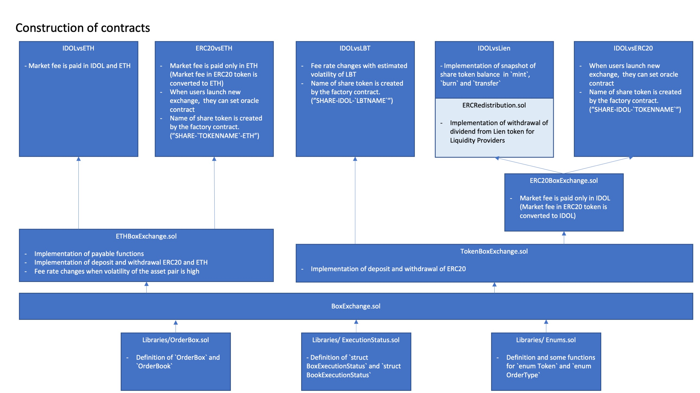
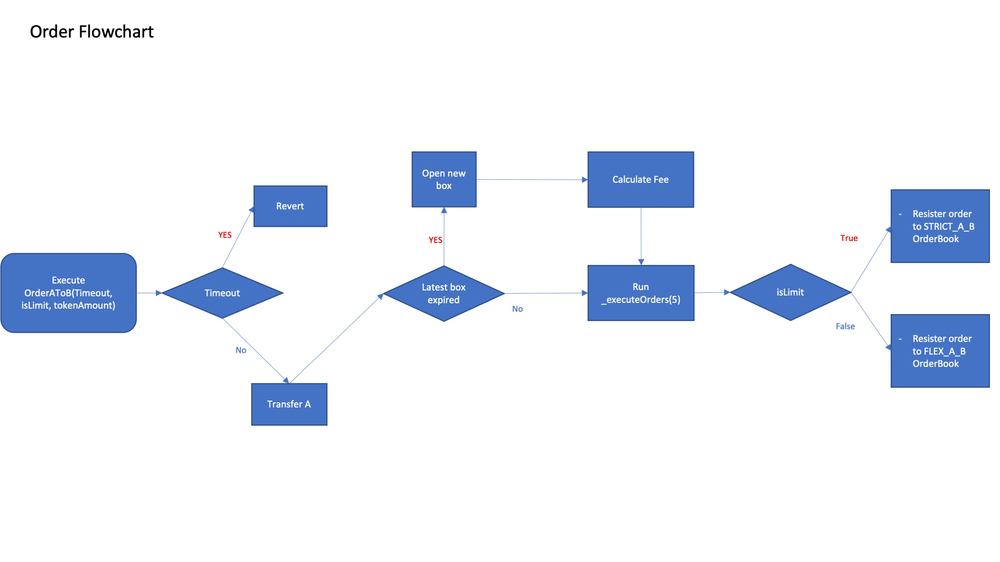
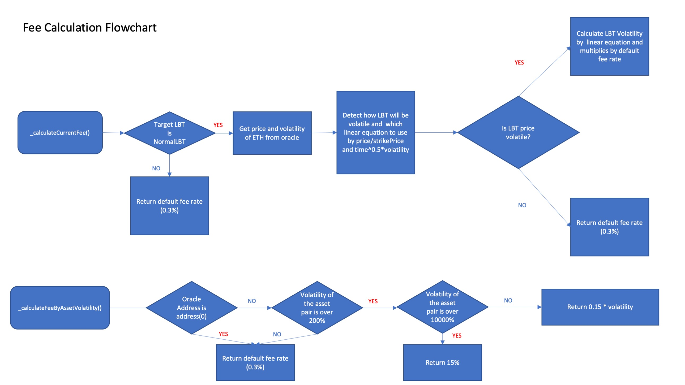
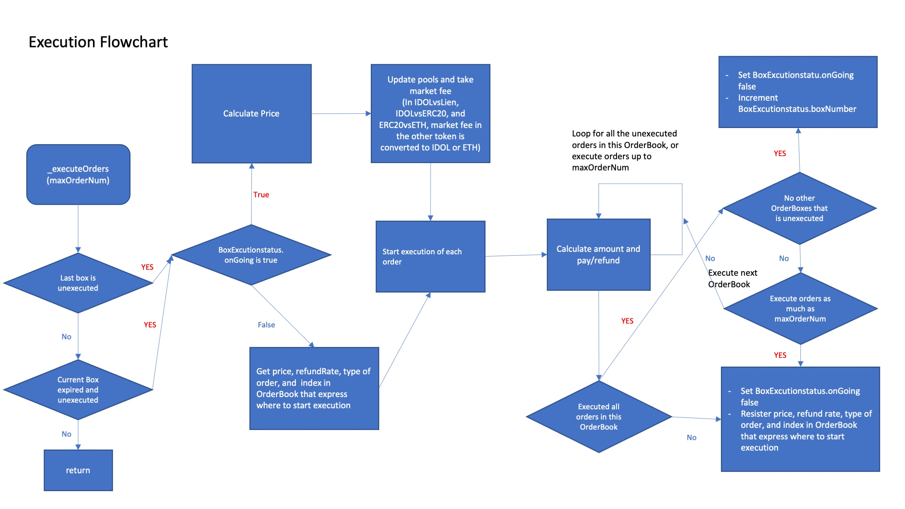
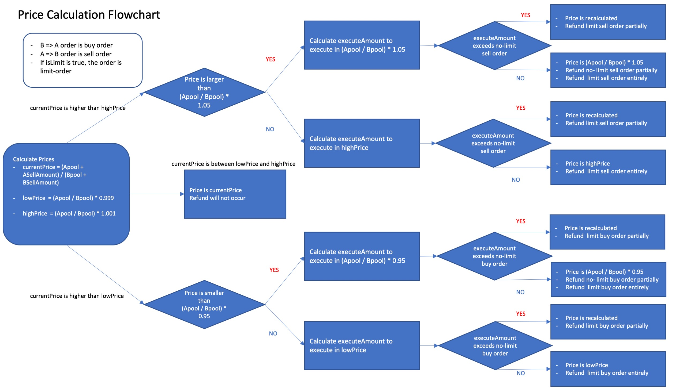
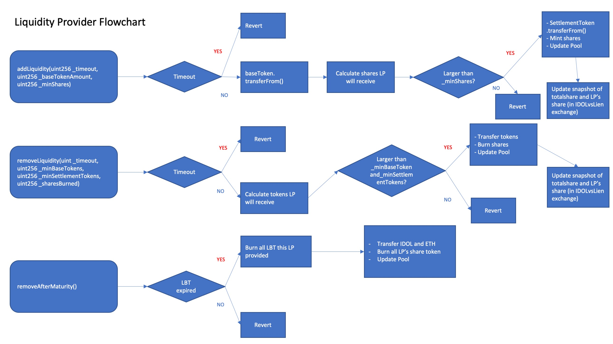
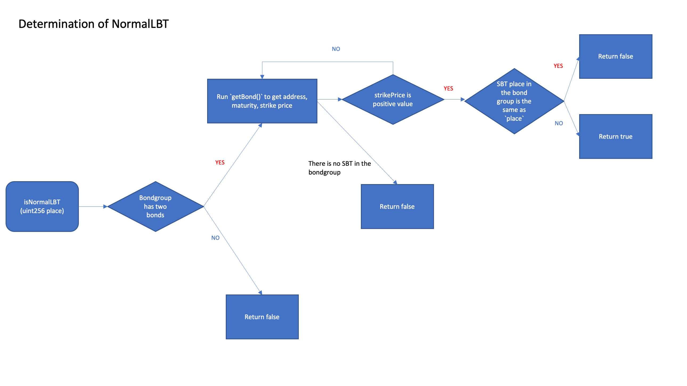
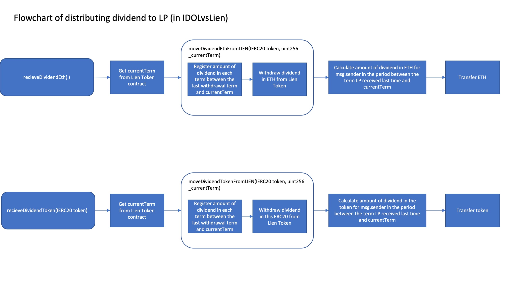

## What is Fairswap?
- Uniswap-like exchange with a frontrunning protection for option tokens such as LBT.
- All trading-orders in some sequential blocks are collected in "Order Box" and are executed in one price regardless of the order recorded in a block.
- User can select Limit order in which funds will be refunded partially or entirely when price moves more than 0.1%, otherwise the order will be executed completely unless price moves more than 5%.
- In a Fairswap which deals with option tokens that fundamentally has a larger volatility than underlying asset, fee price will be adjusted according to the estimated volatility of the option tokens, which is a quite natural practice in traditional option markets. In other Fairswap, if oracle contract is set to the exchange, fee price will be adjusted when volatility of asset pair is high.
- Some part of fee will be transferred to Lien Token. This part of fee is called `market fee`.

## Characteristics of each Fairswap
1. IDOLvsETH
    - Market fee is paid in both IDOL and ETH.
    - Trader should run `withdrawETH()` to get swapped ETH.
2. ERC20vsETH
    - Market fee is paid only in ETH (Market fee in ERC20 token is converted to ETH).
    - User can list any ERC20 token vs ETH exchange with any oracle contract (When there is no oracle contract, fee price will be fixed to 0.3%).
    - If oracle contract is set to the exchange, fee price will be adjusted when volatility of ERC20/ETH is high.
    - Trader should run `withdrawETH()` to get swapped ETH.
3. IDOLvsLBT
    - Market fee is paid in iDOL and ETH converted from LBT.
    - Market fee can be transferred to Lien Token after LBT has expired. LBT is burned and converted to ETH in BondToken contract before transferred to Lien Token.
    - Fee Price is adjusted by estimated volatility of LBT when target LBT is "NormalLBT" (Normal LBT is the one created by tranching ETH into SBT and only one LBT with rational maturity).
    - After LBT expires, Liquidity Providers can burn all the LBT liquidity they provided, and receive all iDOL and ETH by calling RemoveAfterMaturity().
    - After LBT expires, fee price will be adjusted when volatility of ETH/USD is high.
4. IDOLvsLien
    - Market fee is paid only in IDOL (Market fee in Lien Token token is converted to IDOL).
    - Fee price is fixed to 0.3%.
    - Dividend for Lien Token holders in the exchange is distributed to Liquidity Providers pro rata to their shares.
    - To distribute dividend fairly, share token takes snapshot of balance in `mint`, `burn` and `transfer` functions.
5. IDOLvsERC20
    - Market fee is paid only in IDOL (Market fee in other ERC20 tokens is converted to IDOL).
    - If oracle contract is set to the exchange, fee price will be adjusted when volatility of ERC20/ETH is high.
    - User can list every ERC20 token vs IDOL exchange with any oracle contract (When there is no oracle contract, fee price will be fixed to 0.3%).
## Basic architecture of Fairswap

## Test
Three types of tests:
1. mine_for_every_tx -> You can run this test with default blocktime in ganache-cli. Run `yarn ganache:mine_for_every_tx`,  then run `yarn test:mine_for_every_tx`. It takes 5-10 minutes to run.
2. mine_on_interval -> Blocktime of ganache-cli should be equal to or larger than 1 second when you run this test. Run `yarn ganache:mine_on_interval`, then run `yarn test:mine_on_interval`. It takes about 5 minutes to run.
3. greedy_test -> You can run this test with default blocktime in ganache-cli. Run yarn ganache:mine_for_every_tx then run `yarn test:greedy_test`. It takes about 10 minutes to run.